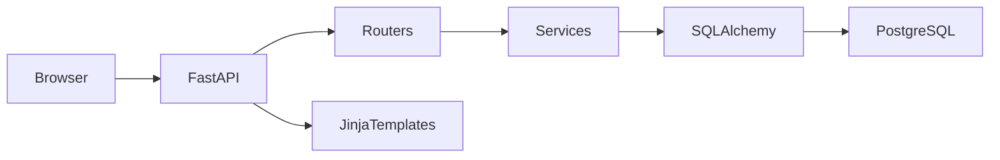

# Arquitetura

## Camadas
- UI Web: templates Jinja em `app/templates`
- API/Controllers: rotas FastAPI em `main.py` e `app/routers/*`
- Regras de negócio: `app/services/*`
- Persistência: SQLAlchemy (`app/models/*`, `app/db/database.py`)
- Infra: Docker, Alembic, APScheduler

## Padrões
- Service Layer
- Multi-tenant por schema PostgreSQL
- RBAC por papel (`superadmin`, `admin`, `professor`, `recepcionista`)

## Tecnologias
FastAPI, SQLAlchemy 2.x, Pydantic 2, Jinja2, PostgreSQL, Alembic, APScheduler.

