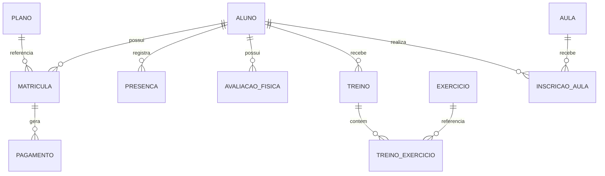

# Banco de Dados

## Modelagem

### Schema public
- `academias`
- `usuarios`
- `planos_globais`
- `password_reset_tokens`

### Schema tenant
- `funcionarios`, `planos`, `alunos`
- `matriculas`, `pagamentos`
- `presencas`, `avaliacoes_fisicas`
- `exercicios`, `treinos`, `treino_exercicios`
- `aulas`, `inscricoes_aulas`
- `notificacoes`

