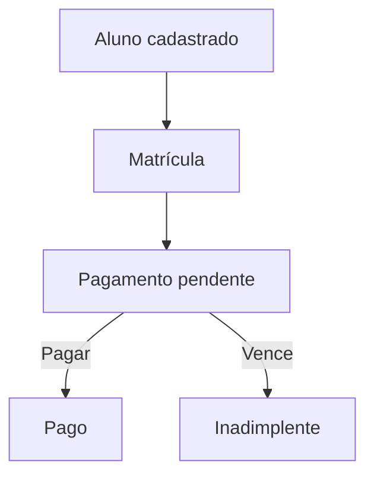
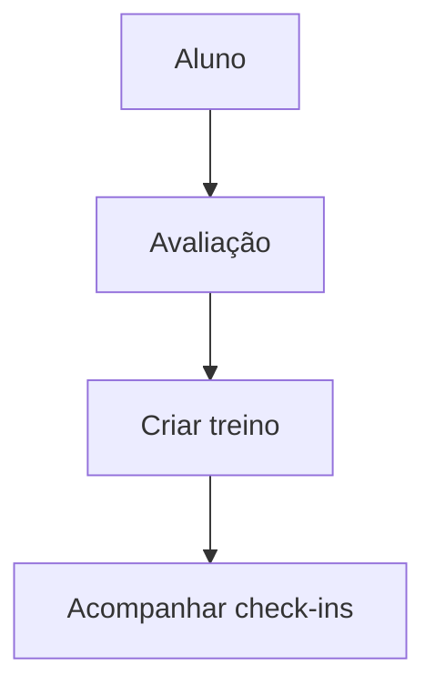

# Fluxos de Usuário

## Primeiros passos
1. Superadmin cria academia
2. (Opcional) cria admin da academia
3. Admin acessa e configura planos/funcionários
4. Cadastro de alunos
5. Matrícula e cobrança

## Fluxo financeiro

## Fluxo treino

